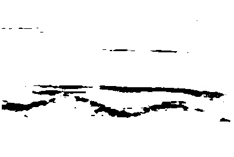
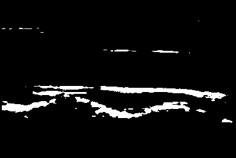
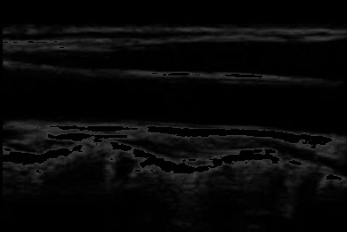
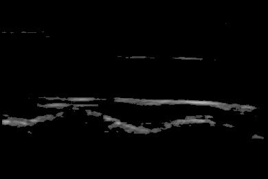
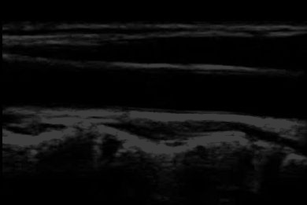

# ImageSegmentation-Threshold
## Thresholding: Simple Image Segmentation using OpenCV
This example will run on Python 2.7/Python 3.4+ and OpenCV 2.4.X/OpenCV 3.0+.
Two packages that we’ll need, ****argparse****  and ****cv2****

### Steps
```bash
1. Extract The ZIP
2. Open Terminal/command prompt
3. cd <<Project Dir>>
4. python3.6 -m venv my_env {help: try with python or python<<version_code>>}
5. source my_env/bin/activate (for windows:my_env\Scripts\activate)
6. pip3 install --upgrade pip
7. pip3 install opencv-python
8. python threshold.py --image <<Image Path>> --threshold 60
```
## Output - Images






Pull requests are welcome. For major changes, please open an issue first to discuss what you would like to change.

## Contribors
[ Anupama R ](https://github.com/r-anupama)
@github/r-anupama

## License
[MIT](https://choosealicense.com/licenses/mit/)
